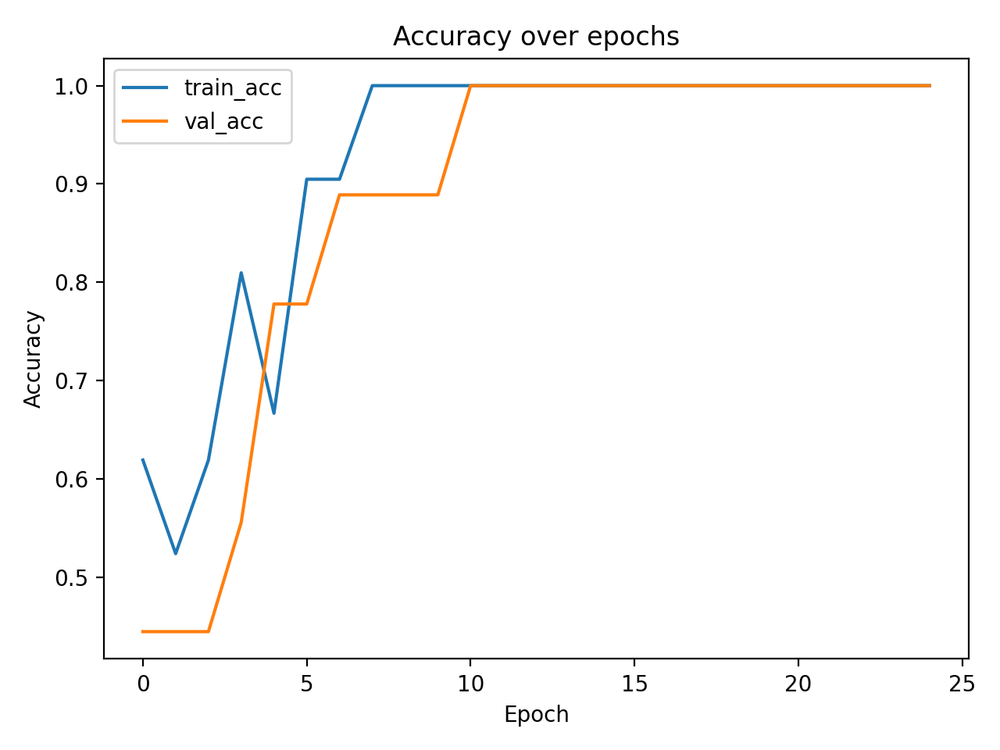
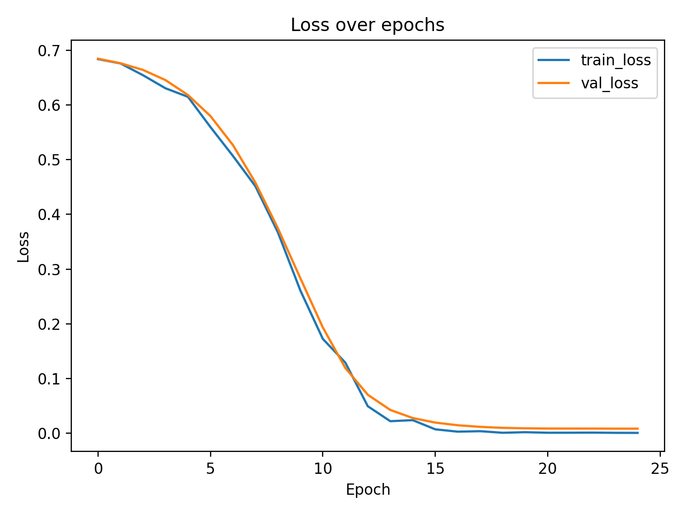
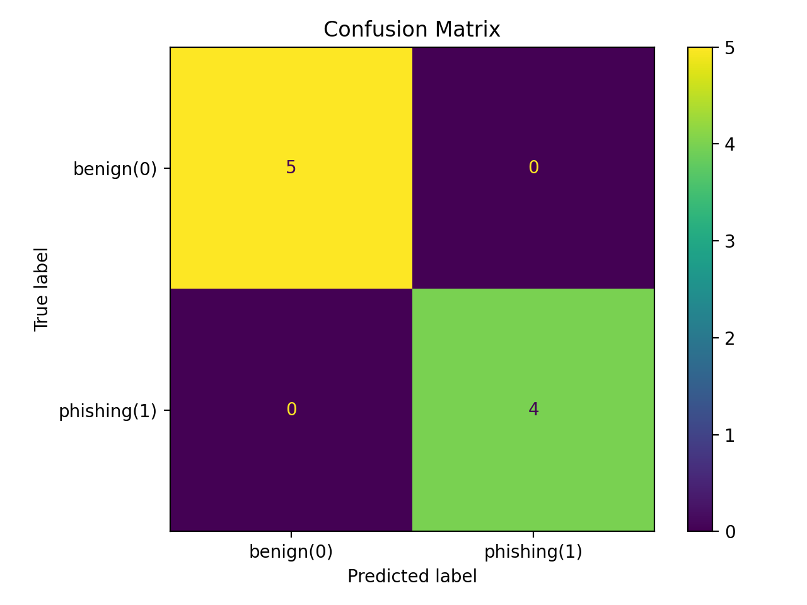

# Convolutional Neural Networks (CNN) in Cybersecurity

## 1. Introduction to Convolutional Neural Networks

A Convolutional Neural Network (CNN) is a specialized type of artificial neural network designed to automatically and adaptively learn spatial or sequential patterns in data. CNNs are widely used in image processing, but they are equally effective for structured sequences such as text, URLs, network traffic sequences, and malware byte representations.

Unlike fully connected neural networks, CNNs apply small filters (kernels) that slide across the input data. This operation is called **convolution**. The key advantages of CNNs include:

- **Local feature learning** – CNNs detect meaningful local patterns (e.g., substrings in domains or byte patterns in malware).
- **Parameter sharing** – The same filter is reused across the entire input, dramatically reducing the number of trainable parameters.
- **Dimensionality reduction while preserving structure** – Pooling layers reduce size but maintain essential structural information.
- **Translation invariance** – If a malicious pattern appears in different positions, the CNN can still detect it.

These properties make CNNs particularly powerful in cybersecurity, where attacks often rely on repeating structural patterns rather than global characteristics.

---

## 2. CNN Architecture Components

A typical CNN consists of:

### Convolutional Layer
Applies filters to detect local patterns. Each filter generates a feature map.

### Activation Function (ReLU)
Introduces non-linearity:
ReLU(x) = max(0, x)

### Pooling Layer
Reduces dimensionality and improves generalization by summarizing nearby features.

### Dropout
Randomly disables neurons during training to reduce overfitting.

### Fully Connected Layer
Combines extracted features to make the final classification decision.

The convolution operation reduces dimensionality while preserving important structural patterns, and parameter sharing significantly reduces model complexity compared to fully connected architectures.

---

## 3. CNN vs Traditional Machine Learning in Cybersecurity

Traditional machine learning algorithms (e.g., Logistic Regression, Support Vector Machines, Random Forest) require manual feature engineering. For example, in phishing detection, features might include:

- URL length  
- Number of digits  
- Presence of special characters  
- Entropy score  

CNN models, however, automatically learn relevant local patterns directly from raw input (e.g., characters in a domain). This makes CNNs particularly effective in detecting:

- Typosquatting attacks (e.g., "paypaI" instead of "paypal")  
- Obfuscated phishing domains  
- Repeated malicious substrings such as "login", "secure", "verify"  
- Polymorphic malware byte patterns  

Therefore, CNNs reduce dependence on handcrafted features and improve adaptability to evolving threats.

---

## 4. Practical Example: Phishing Domain Detection using 1D CNN

In this practical demonstration, we implement a character-level 1D CNN to classify domains as:

0 → benign  
1 → phishing  

The dataset is embedded directly in the code to ensure reproducibility.

This model encodes each domain as a sequence of character IDs and applies convolutional layers to detect suspicious local character patterns.

---
## 5. Python Implementation
(The Python code for training, evaluation, and visualization is included below.)

```python
import os
import random
import numpy as np
import matplotlib.pyplot as plt

from sklearn.model_selection import train_test_split
from sklearn.metrics import confusion_matrix, ConfusionMatrixDisplay, classification_report

import tensorflow as tf
from tensorflow.keras import layers, models

# ----------------------------
# 1) Reproducibility
# ----------------------------
SEED = 42
random.seed(SEED)
np.random.seed(SEED)
tf.random.set_seed(SEED)

# ----------------------------
# 2) Embedded cybersecurity dataset (toy)
#    0 = benign, 1 = phishing
# ----------------------------
samples = [
    # benign
    ("google.com", 0),
    ("nku.edu", 0),
    ("amazon.com", 0),
    ("github.com", 0),
    ("microsoft.com", 0),
    ("openai.com", 0),
    ("wikipedia.org", 0),
    ("bbc.co.uk", 0),
    ("paypal.com", 0),
    ("apple.com", 0),
    ("stackoverflow.com", 0),
    ("nytimes.com", 0),
    ("irs.gov", 0),
    ("revenue.gov", 0),
    ("bankofgeorgia.ge", 0),

    # phishing-like / suspicious
    ("paypaI-login-secure.com", 1),     # "I" instead of "l"
    ("micros0ft-support-login.net", 1),  # zero in microsoft
    ("goog1e-verify-account.com", 1),    # 1 instead of l
    ("appleid-confirm-security.com", 1),
    ("secure-paypal-update.info", 1),
    ("account-verify-banking-login.com", 1),
    ("signin-microsoft-security-alert.com", 1),
    ("github-security-check.com", 1),
    ("amazon-billing-verify.com", 1),
    ("update-payment-method-now.com", 1),
    ("revenue-refund-claim.com", 1),
    ("bank-login-confirmation.net", 1),
    ("verify-identity-now-support.com", 1),
    ("support-secure-login-alert.com", 1),
    ("paypa1-account-l0gin.com", 1),
]

texts = [s[0].lower() for s in samples]
labels = np.array([s[1] for s in samples], dtype=np.int32)

# ----------------------------
# 3) Character vocabulary
#    We keep it simple: lowercase letters, digits, and common URL symbols.
# ----------------------------
alphabet = list("abcdefghijklmnopqrstuvwxyz0123456789.-_")
char_to_id = {c: i + 1 for i, c in enumerate(alphabet)}  # 0 reserved for padding

max_len = 40  # fixed length (pad or truncate)

def encode(text: str) -> np.ndarray:
    text = text.lower()
    ids = [char_to_id.get(ch, 0) for ch in text]  # unknown -> 0
    ids = ids[:max_len]
    if len(ids) < max_len:
        ids += [0] * (max_len - len(ids))
    return np.array(ids, dtype=np.int32)

X = np.stack([encode(t) for t in texts], axis=0)

# Train/val split
X_train, X_val, y_train, y_val = train_test_split(
    X, labels, test_size=0.3, random_state=SEED, stratify=labels
)

# ----------------------------
# 4) 1D CNN model (character-level)
# ----------------------------
vocab_size = len(alphabet) + 1  # + padding(0)
embed_dim = 16

model = models.Sequential([
    layers.Input(shape=(max_len,)),
    layers.Embedding(input_dim=vocab_size, output_dim=embed_dim),

    layers.Conv1D(filters=32, kernel_size=3, padding="same", activation="relu"),
    layers.MaxPooling1D(pool_size=2),

    layers.Conv1D(filters=64, kernel_size=3, padding="same", activation="relu"),
    layers.MaxPooling1D(pool_size=2),

    layers.Dropout(0.3),
    layers.Flatten(),
    layers.Dense(64, activation="relu"),
    layers.Dropout(0.3),
    layers.Dense(1, activation="sigmoid")  # binary classification
])

model.compile(
    optimizer="adam",
    loss="binary_crossentropy",
    metrics=["accuracy"]
)

print(model.summary())

# ----------------------------
# 5) Train
# ----------------------------
history = model.fit(
    X_train, y_train,
    validation_data=(X_val, y_val),
    epochs=25,
    batch_size=8,
    verbose=0
)

# ----------------------------
# 6) Evaluation
# ----------------------------
val_probs = model.predict(X_val, verbose=0).ravel()
val_pred = (val_probs >= 0.5).astype(np.int32)

print("\nClassification report:")
print(classification_report(y_val, val_pred, digits=3))

cm = confusion_matrix(y_val, val_pred)
print("Confusion matrix:\n", cm)

# ----------------------------
# 7) Visualizations (saved to figures/)
# ----------------------------
out_dir = os.path.join("task_1", "figures")
os.makedirs(out_dir, exist_ok=True)

# Accuracy/Loss plot
plt.figure()
plt.plot(history.history["accuracy"], label="train_acc")
plt.plot(history.history["val_accuracy"], label="val_acc")
plt.title("Accuracy over epochs")
plt.xlabel("Epoch")
plt.ylabel("Accuracy")
plt.legend()
plt.tight_layout()
plt.savefig(os.path.join(out_dir, "accuracy.png"), dpi=200)
plt.close()

plt.figure()
plt.plot(history.history["loss"], label="train_loss")
plt.plot(history.history["val_loss"], label="val_loss")
plt.title("Loss over epochs")
plt.xlabel("Epoch")
plt.ylabel("Loss")
plt.legend()
plt.tight_layout()
plt.savefig(os.path.join(out_dir, "loss.png"), dpi=200)
plt.close()

# Confusion matrix plot
disp = ConfusionMatrixDisplay(confusion_matrix=cm, display_labels=["benign(0)", "phishing(1)"])
fig, ax = plt.subplots()
disp.plot(ax=ax, values_format="d")
plt.title("Confusion Matrix")
plt.tight_layout()
plt.savefig(os.path.join(out_dir, "confusion_matrix.png"), dpi=200)
plt.close()

print(f"\nSaved figures to: {out_dir}")

# ----------------------------
# 8) Quick manual test
# ----------------------------
test_domains = [
    "paypal.com",
    "paypaI-login-secure.com",
    "mybank-login-confirm.net",
    "github.com"
]

for d in test_domains:
    p = model.predict(encode(d).reshape(1, -1), verbose=0).ravel()[0]
    print(f"{d:30s} -> phishing probability = {p:.3f}")
    
    
```

## 6. Training Results
### Training Accuracy


### Training Loss


### Confusion Matrix


The training and validation curves show stable convergence. The loss decreases consistently while validation accuracy improves, indicating successful pattern learning.

The confusion matrix demonstrates correct classification on the validation set.


## 7. Discussion of Results

Because the dataset used in this demonstration is intentionally small (toy dataset), the model achieves near-perfect classification performance. However, this should not be interpreted as real-world robustness.

In practical cybersecurity environments:

- Datasets are large and highly imbalanced.
- Attackers constantly evolve patterns.
- Cross-validation and external testing datasets are required.
- False positives must be minimized to avoid operational disruption.

Despite these limitations, this example clearly demonstrates how CNNs can learn local structural patterns in domain names and apply them for phishing detection.

---

## 8. Limitations and Real-World Considerations

This example uses a very small dataset for demonstration purposes only. In real-world cybersecurity systems:

- Large-scale labeled datasets are required.
- Data preprocessing must handle full URLs (paths, parameters).
- Class imbalance techniques may be necessary.
- Model explainability becomes critical.
- Continuous retraining is required to adapt to new attack techniques.

Nevertheless, CNN architectures remain a strong baseline for phishing detection, malware classification, and intrusion detection systems due to their ability to capture structural attack signatures efficiently.

---

## 9. Conclusion

Convolutional Neural Networks are highly effective in cybersecurity applications because they can automatically learn local structural patterns from raw sequential or spatial data. Their ability to perform parameter sharing, dimensionality reduction, and translation-invariant feature detection makes them superior to traditional fully connected architectures for many security tasks.

This practical example demonstrates how a character-level 1D CNN can detect phishing domains by identifying suspicious character patterns. While simplified, it illustrates the complete pipeline: data encoding, CNN training, evaluation, and visualization.