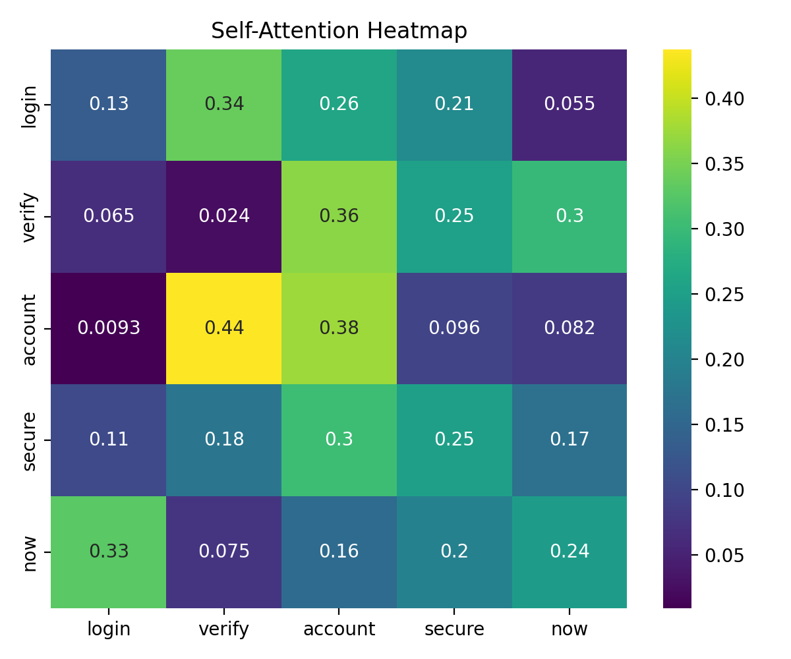
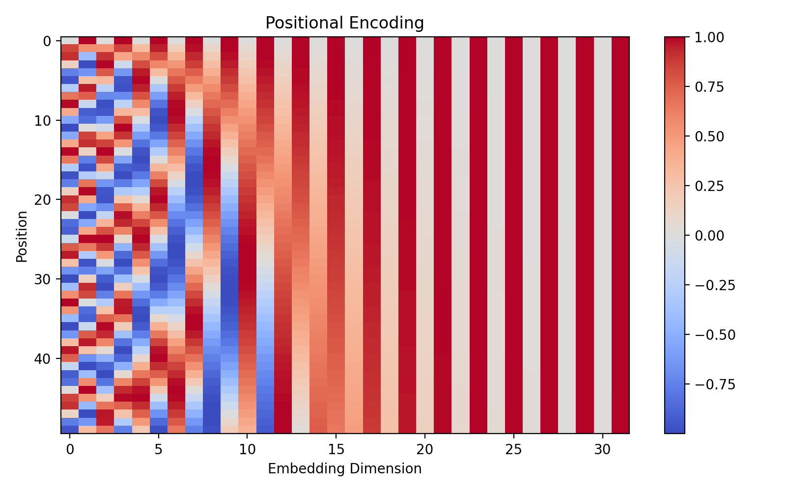

# Transformer Networks and Their Applications in Cybersecurity

## 1. Introduction to Transformer Networks

The Transformer network is a deep learning architecture introduced in 2017 in the paper *“Attention is All You Need.”* Unlike CNNs or RNNs, Transformers rely entirely on a mechanism called **self-attention** to model relationships between elements in a sequence.

Traditional sequence models (like RNNs and LSTMs) process data sequentially, which limits parallelization and makes learning long-range dependencies difficult. Transformers solve this by computing attention across all tokens simultaneously, allowing efficient parallel computation and better modeling of global context.

The core innovation of Transformers is the **Attention Mechanism**, which enables the model to determine which parts of the input sequence are most relevant when processing each token.

---

## 2. Self-Attention Mechanism

Self-attention computes three vectors for each token:

- Query (Q)
- Key (K)
- Value (V)

The attention score is calculated as:

Attention(Q, K, V) = softmax(QKᵀ / √d_k) V

This allows each token to weigh the importance of all other tokens in the sequence.

In cybersecurity, this is powerful because malicious patterns often depend on relationships between distant elements in a log entry, command sequence, or network flow.

---

## 3. Positional Encoding

Since Transformers do not process data sequentially like RNNs, they require **positional encoding** to preserve word order information.

Positional encoding uses sinusoidal functions:

PE(pos, 2i) = sin(pos / 10000^(2i/d_model))  
PE(pos, 2i+1) = cos(pos / 10000^(2i/d_model))

This injects information about token position into the embedding space.

---

## 4. Applications in Cybersecurity

Transformers are increasingly used in cybersecurity due to their ability to model complex dependencies:

### 1. Phishing Detection
Transformers analyze full URLs, email content, and HTML structures to detect subtle contextual patterns.

### 2. Malware Classification
Byte sequences of executables can be treated like language tokens, allowing Transformers to learn malicious opcode relationships.

### 3. Intrusion Detection
Transformers model sequences of network events, capturing long-term attack patterns such as multi-stage intrusions.

### 4. Log Anomaly Detection
System logs are sequential and contextual. Transformers detect deviations in event sequences.

### 5. Threat Intelligence Analysis
Large Language Models (LLMs), built on Transformers, help summarize security reports and correlate attack indicators.

Compared to CNNs, Transformers excel at capturing global dependencies rather than only local patterns.

---

## 5. Visualization of Attention Mechanism

Below is a visualization of the self-attention matrix, showing how each token attends to others:

---

## 6. Visualization of Positional Encoding

The following image shows sinusoidal positional encoding patterns:

---

## 7. Discussion

Transformers outperform traditional sequence models in many cybersecurity tasks because they can model long-range dependencies and contextual relationships. However, they require significant computational resources and large datasets.

Despite their complexity, Transformers form the foundation of modern AI systems, including security-focused language models and anomaly detection systems.

---

## 8. Conclusion

Transformer networks revolutionized sequence modeling by replacing recurrence with self-attention. Their ability to model contextual relationships makes them particularly effective in cybersecurity applications such as phishing detection, malware analysis, and intrusion detection.

The combination of attention mechanisms and positional encoding allows Transformers to capture both structure and order in security data, making them one of the most powerful architectures in modern AI-based defense systems.
