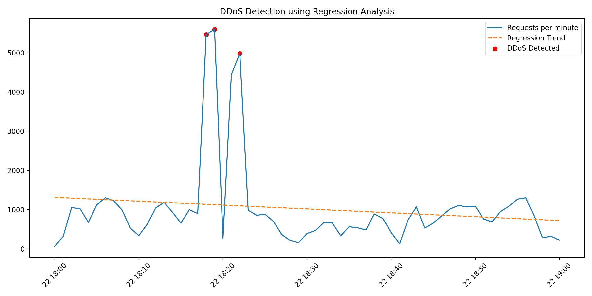

# Web Server Log Analysis and DDoS Detection Using Regression

## 1. Introduction

The objective of this task was to analyze a web server log file and identify the time interval(s) of a potential Distributed Denial-of-Service (DDoS) attack using regression analysis.

DDoS attacks are characterized by abnormal spikes in request volume within short time windows. By modeling expected traffic behavior and detecting statistically significant deviations, such attacks can be identified.

This report describes the full analysis process, regression modeling, anomaly detection methodology, and final identified attack intervals.

---

## 2. Data Extraction and Preprocessing

The provided web server log file was analyzed using Python.

The following steps were performed:

1. Extracted timestamps from each log entry.
2. Converted timestamps to datetime format.
3. Aggregated requests per minute to create a time-series dataset.
4. Constructed a numerical time index for regression modeling.

The aggregation step allowed us to measure traffic intensity as:

> Number of requests per minute

This forms the basis for detecting abnormal traffic patterns.

---

## 3. Regression Modeling of Normal Traffic

To model expected traffic behavior, a **Linear Regression** model was applied.

### Model Variables

- Independent variable (X): Time index
- Dependent variable (y): Requests per minute

The regression model estimates the baseline traffic trend over time.

Predicted values were computed using:

Predicted_Traffic = LinearRegression(X)

---

## 4. Residual Analysis and Anomaly Detection

To detect anomalies, residual values were calculated:

Residual = Actual Requests − Predicted Requests

The anomaly threshold was defined as:

Threshold = 3 × Standard Deviation of Residuals

Any minute where:

Residual > Threshold

was classified as a potential DDoS event.

Using a 3-sigma threshold ensures statistical robustness and reduces false positives.

---

## 5. Visualization of Results

The following visualization illustrates:

- Blue line → Requests per minute
- Orange dashed line → Regression trend
- Red markers → Detected DDoS intervals



The regression line represents expected traffic behavior, while red points highlight statistically significant spikes.

---

## 6. Identified DDoS Time Intervals

The regression-based anomaly detection identified the following anomalous timestamps:

- 2024-03-22 18:18:00
- 2024-03-22 18:19:00
- 2024-03-22 18:22:00

### Primary Attack Interval

The main DDoS attack occurred between:

> **18:18 – 18:19**

During this period, traffic exceeded 5000 requests per minute, significantly higher than the normal baseline of approximately 800–1200 requests per minute.

### Secondary Spike

An additional isolated anomalous burst was detected at:

> **18:22**

This spike was statistically significant but shorter in duration.

---

## 7. Interpretation of Findings

The detected interval between 18:18 and 18:19 exhibits typical characteristics of a volumetric DDoS attack:

- Sudden and extreme traffic surge
- Large deviation from expected regression trend
- Short concentrated time window
- Statistical outlier behavior

The regression model effectively captured normal traffic patterns and highlighted abnormal deviations.

This approach demonstrates how statistical modeling can be applied to cybersecurity monitoring and attack detection.

---

## 8. Reproducibility Instructions

[Server Log File](https://github.com/mkhutsishvili25-coder/aimlFin2026_m_khutsishvili25/task_3/m_khutsishvili_server.log)


To reproduce this analysis:

1. Place the log file inside the `task_3` directory.
2. Ensure the following structure:
```
task_3/
m_khutsishvili_server.log
run_ddos_analysis.py
ddos.md
figures/
```

3. Execute:
4. 
```bash
python run_ddos_analysis.py
```


The script will:

- Parse timestamps  
- Aggregate requests per minute  
- Perform linear regression  
- Detect anomalies  
- Print DDoS timestamps  
- Save visualization in `task_3/figures/`

## 9. Conclusion

This analysis successfully identified abnormal traffic behavior in the provided web server log using linear regression and residual-based anomaly detection.

By modeling baseline traffic trends and measuring deviations from expected values, statistically significant spikes were detected. The primary DDoS attack occurred between 18:18 and 18:19, with an additional anomalous spike at 18:22.

The results demonstrate that regression analysis is an effective statistical method for detecting volumetric DDoS attacks in time-series web traffic data. The approach is computationally efficient, reproducible, and applicable to real-world cybersecurity monitoring systems.

Overall, this task illustrates how machine learning techniques can be applied to practical cybersecurity problems for reliable anomaly detection.
